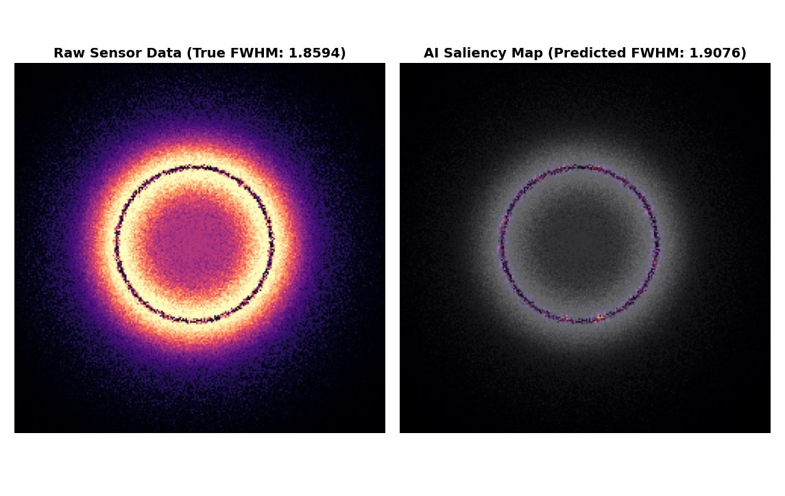
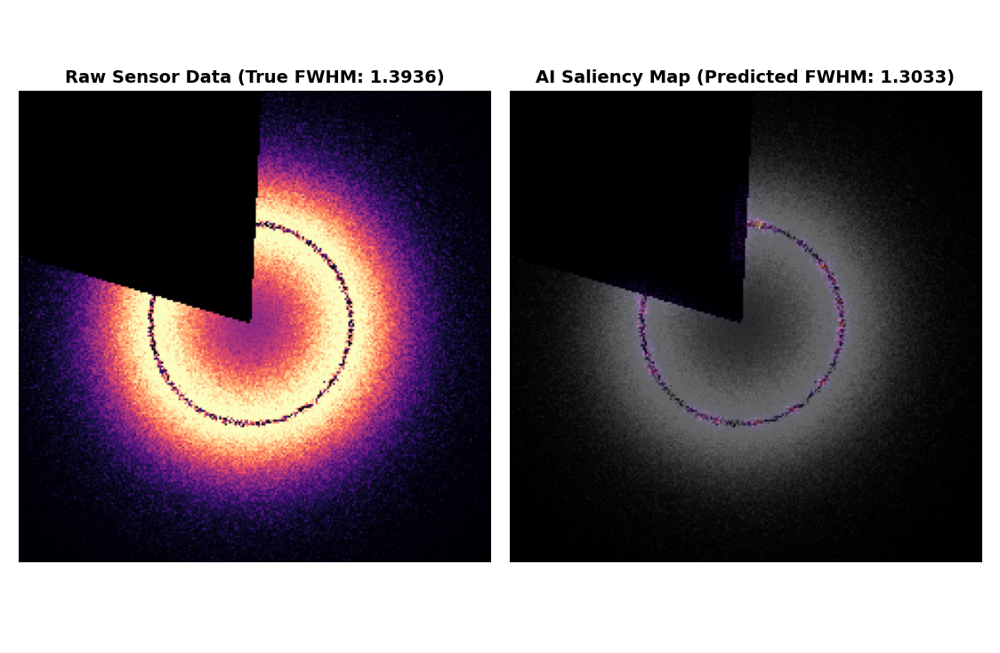

# Fabry-Perot-CNN-Extractor
**Robust Absorption Line Extraction via Chaotic Data Occlusion**

## The Physics Objective
This repository deploys a Convolutional Neural Network (CNN) to extract the Full Width at Half Maximum (FWHM) from noisy 2D Fabry-Perot interferometry data. 

Standard deep learning models trained on perfect laboratory simulations inherently overfit to background thermal noise. When physical sensors fail or degrade, these traditional algorithms experience mathematical collapse. 

This architecture utilizes a **forced 50% data occlusion rate** during the training phase. By violently blacking out random sectors of the plasma ring during tensor generation, we create a strict information bottleneck. This strips away the network's ability to memorize static, forcing it to learn the fundamental, underlying geometry of the absorption line. 

## The Visual Cortex (Saliency Map)
By calculating the mathematical gradient of the network's final prediction backward through the convolutional layers, we generate a Saliency Heatmap. This proves the network is not blindly guessing. Even when the physical ring is shattered by sensor damage, the digital optic nerve traces the ghost of the missing curvature to calculate the FWHM.

Pristine Verse.

Occluded Verse.

## Architectural Taxonomy

The system is constructed as a modular, 5-stage pipeline optimized for Apple Silicon (MPS).

* **`data_creation.py` (The Forge):** Dynamically generates thousands of Fabry-Perot matrices using natural inverse-square light decay. Controls the quantum coin-flip for the 50/50 occlusion training dataset.
* **`brain.py` (The Anatomy):** Contains the `Spectroscopic_Brain` class. A continuous regression CNN utilizing aggressive 5x5 Max Pooling layers to downsample noise while preserving massive geometric curvatures. 
* **`train.py` (The Crucible):** The training loop that forces the network to converge on the chaotic dataset.
* **`arbitration.py` (The Judge):** Provides the error percentage made by a network. Used to check for the accuracy of the model, to confirm if it's learning or memorizing.
* **`saliency_scan.py` (The Photographer):** Rips open the AI's visual cortex during inference to generate the thermal overlay of its active logic.

## Foundational Literature
The architectural methodology and physical constants utilized in this engine build upon the following frameworks:
1. Goodfellow, I., Bengio, Y., & Courville, A. (2016). *Deep Learning*. MIT Press.
2. DeVries, T., & Taylor, G. W. (2017). Improved Regularization of Convolutional Neural Networks with Cutout. *arXiv:1708.04552*.
3. Hecht, E. (2016). *Optics* (5th ed.). Pearson.
4. Carleo, G., et al. (2019). Machine learning and the physical sciences. *Reviews of Modern Physics*, 91(4).

*Engineered by Sapun Sunar